# Project Overview

This project introduces a approach to automating economic experiments by leveraging Large Language Models (LLMs). It utilizes OpenAI's API to create a multi-actor simulation environment where different LLM agents act as economic entities with distinct roles, preferences, and information. This setup aims to mimic complex economic scenarios within a digital platform, enabling efficient and ethical experimentation on a wide range of economic theories and institutional designs.

### Project Goals: Enhancing LLM Agent Reasoning in Economic Experiments
#### Note: these things change over time but I like to keep them here for reference

The project aims to substantially improve the reasoning abilities of LLMs used as agents in economic experiments, focusing on these objectives:

#### 1. **Refine Instruction Parsing**
- **Goal:** Develop a more sophisticated parsing process that accurately interprets and summarizes complex instructions, ensuring LLM agents receive a rich, contextual understanding of their tasks.
- **Approach:** Enhance the summarization pipeline to preserve essential context and integrate contextual clues that aid in understanding the broader economic scenarios.

#### 2. **Expand Context with Advanced Techniques**
- **Goal:** Utilize advanced machine learning techniques and dynamic prompting to enrich the context available to LLM agents, improving their decision-making in complex scenarios.
- **Approach:** Implement dynamic prompting strategies, integrate external knowledge bases, and explore ML models that specialize in context retention and understanding.

**Expected Outcome:** These improvements aim to make LLM agents’ reasoning more sophisticated and human-like, enhancing the fidelity of economic experiments and opening new avenues for economic research.

## 📂 Project Structure

| File/Directory                          | Description                                                                                                                                      |
|-----------------------------------------|--------------------------------------------------------------------------------------------------------------------------------------------------|
| `src/constructDataset.py`               | Reads `.log.json` files from `data/raw`, extracts "log" data, and compiles it into a JSON Lines file in `data/processed`.                        |
| `data/`                                 | Contains all data-related files and subdirectories, including raw data, processed data, and output data.                                         |
| `data/raw/`                             | Houses source `.log.json` files used for dataset creation.                                                                                       |
| `data/processed/training_set_voting.jsonl` | Generated dataset consisting of extracted log entries, ready for model training. Stored within the `processed` subdirectory.                    |
| `data/output/`                          | Contains output files such as `outputAfter.txt` and `outputBefore.txt`, showcasing results or data transformations.                              |
| `src/finetune.py`                       | Interacts with the OpenAI API to fine-tune a GPT model using the prepared dataset located in `data/processed`.                                   |
| `src/handler.py`, `src/handlerNoGPT.py` | Manage WebSocket connections for real-time server-client communication and handle specific actions as instructed by LLM agents.                  |
| `config/token.txt`                      | Stores configuration details or sensitive information like API tokens.                                                                           |
| `instructions/`                         | Contains instructional documents in various formats (e.g., docx) that detail how the project or certain components should be used or operated.    |
| `src/instructionReader.py`              | Reads and formats instructions from documents in the `instructions/` directory and classifies how and when the instructions will be parsed.      |
| `scripts/killer.sh`, `scripts/serverStarter.sh` | Shell scripts for managing server processes, including initialization and termination.                                                         |

## 🚀 Usage

### Preparing the Dataset

Extract and prepare the dataset from simulation logs for LLM training:

```bash
python constructDataset.py
```

### Fine-tuning the Model

Adapt LLM agents to specific economic behaviors and scenarios:

```bash
python finetune.py
```

### WebSocket Communication
Facilitate real-time decision-making and interaction in simulations:

```bash
python handler.py
```

### Controlling the Server

Start and stop server processes as needed:

- **To start:** `sh serverStarter.sh`
- **To stop:** `sh killer.sh`

## ✅ Requirements

Ensure your environment meets the following prerequisites:

- **Python 3.x:** The backbone of the project for scripting and data processing.
- **OpenAI API Key:** Essential for accessing LLM services and fine-tuning.
- **WebSocket Implementation:** Critical for real-time simulation and agent communication.

## Architecture Overview




## 📌 LLM Agent Integration Overview
Initially, the LLM agent is briefed using the same document provided to human subjects. The `instructionReader.py` script processes these documents by parsing, converting them to JSON format, and summarizing the content.

### Instruction Format

The instructions for the LLM agent are encapsulated in JSON format. Here is an example structure showcasing how the agent is briefed on the project's various phases, including an overview and key actions like requests, offers, and voting.

```json
{
    "Overview": [
        "The experiment simulates a democratic situation where owners vote. If the majority votes for the project, it gets developed. Players either implement a Project, or no Project is implemented."
    ],
    "Request": [
        "In the 'request' phase, the developer waits while owners make compensation requests. All requests are shown to the developer in the next phase, not to other voters."
    ],
    "Offer": [
        "After receiving requests, the developer sees the amounts in area 8. In area 10, they set the offer amount, the compensation offered to each owner if the Project is implemented. The developer's profit is visible if the offer is accepted."
    ],
    "Voting": [
        "In the voting phase, the developer is inactive, and owners vote on the project's development. Voting involves selecting an option in the tick boxes and pressing the vote button. If the majority votes in favor, the project is developed, and the developer pays the compensation amount to each owner. The game then progresses to the next round."
    ]
}
```

### Game Introduction Instructions

At the game's start, the LLM agent receives instructions defining how to respond to different events, ensuring a smooth integration and participation process.

```json
{
    "eventType": "introduction-instructions",
    "data": {
        "welcomeMessage": "Welcome to the Voting Game as an LLM agent.",
        "roleAssignment": "Your specific role and instructions will be provided at each game phase.",
        "responseTiming": "Prompt responses are crucial. Respond before the phase timer expires.",
        "responseFormat": "Responses should be in JSON format, with attributes as per instructions.",
        "example": {
            "actionType": "ExampleAction",
            "instructions": "Example response format: {\"gameId\":Y, \"type\":\"action-type\", \"details\":[\"specific details\"]}.",
            "actionRequiredBy": "Timely action is essential for game progression.",
            "additionalInfo": "Pay close attention to role-specific instructions for effective participation."
        }
    }
}
```

### Action Required Message Example

An example message illustrates how the LLM agent receives detailed instructions for taking action, emphasizing the importance of precision and timeliness.

```json
{
    "type": "event",
    "eventType": "action-required",
    "data": {
        "actionType": "SubmitCompensationRequest",
        "instructions": "Enter the Compensation Request Phase. Submit your request using the format: {'gameId':Y, 'type':'compensation-request', 'compensationRequests':[null,X]}, where X is your compensation amount.",
        "deadline": "Submit before the timer ends at [timestamp].",
        "format": "{'gameId':Y, 'type':'compensation-request', 'compensationRequests':[null,X]}",
        "actionRequiredBy": "[timestamp]",
        "additionalInfo": "This phase is crucial for project negotiation. Ensure your submission is timely and accurate."
    }
}
```

### How to define roles and actions for the OpenAI API
1. **User (`"role": "user"`):**
   - This role is used for messages that are supposed to come from the user of the system. It represents questions, statements, or any input that the user provides which the model needs to respond to.
   - In a chat or conversation context, these are the inputs that prompt replies from the model.

2. **Assistant (`"role": "assistant"`):**
   - The assistant role is assigned to messages generated by the model itself in response to the user inputs. It represents the model's replies, advice, explanations, or any output generated in response to the user's query.
   - This is what the model says back to the user in a conversational exchange.

3. **System (`"role": "system"`):**
   - The system role is used for messages that provide context, instructions, or any information that is not directly part of the back-and-forth conversation between the user and the model but is essential for guiding the model's responses. 
   - This can include setting rules, providing background information, initializing scenarios, or any metadata that helps the model understand the context or constraints within which it should operate.
   - Messages with the system role are not displayed as part of the conversation flow but influence the model's understanding and responses.

### Dynamic Scenario Simulation

Agents are dynamically assigned roles and objectives based on the specific economic theory or institutional design being tested. Each simulation can explore different facets of economic behavior, from market speculation to resource allocation, in a controlled yet complex virtual environment.